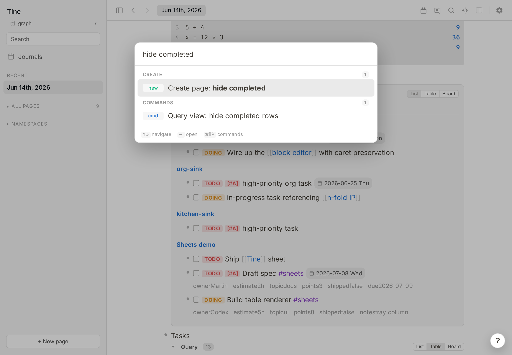
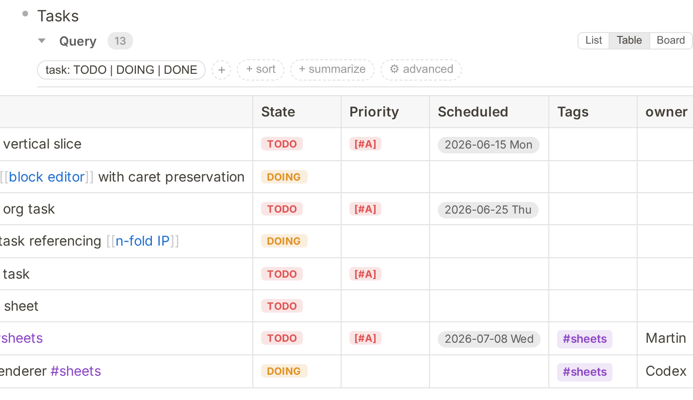

# Query filter shortcuts for Tine

Hide completed tasks from a query table or board with one command.



After the command, `DONE`, `CANCELED`, and `CANCELLED` rows are hidden while the query itself stays unchanged:



## How to use it

1. Install and enable **Query filter shortcuts** in **Settings → Plugins**.
2. Switch a query block to **Table** or **Board**.
3. Click the query block so Tine knows which block the command should affect.
4. Press **Ctrl-K** (or **Cmd-K** on macOS), type `hide completed`, and choose
   **Query view: hide completed rows**.
5. Tine adds this property to that block:

   ```text
   tine.filter:: state != "DONE" && state != "CANCELED" && state != "CANCELLED"
   ```

Use normal Undo immediately after running the command, or edit the block and
remove the `tine.filter::` line, to show completed rows again. Running the
command twice does not add a duplicate filter. Version 0.1.1 also replaces the
incorrect `status != "done"` line written by version 0.1.0.

## Why this plugin needed human review

The plugin has the `graph.write.block` capability: when you explicitly run its
command, it may ask Tine to replace the focused block. Tine automatically holds
every graph-writing plugin for a person to review before publication.

The audit caught that an earlier draft could act on a focused block that was not
a query table or board. The published plugin was narrowed to the documented
target. Its write is also an expected-text host effect: Tine rejects the change
if the focused block or its content changed, records normal Undo, and saves
through Tine's conflict-safe path.

The audit's **low-risk finding** concerns a hostile, oversized event supplied to
the plugin's bounded 16 MiB WebAssembly memory. It could make this plugin stop
running, but does not give it new access and is not expected to affect notes.
“Low” describes possible impact; it is not a reviewer-confidence score.

## Development

Build with `cargo build --release`, then run Tine's `plugin:check` command on
this directory. Licensed MIT. AI-primary development, reviewed and published by
Martin Koutecký.

